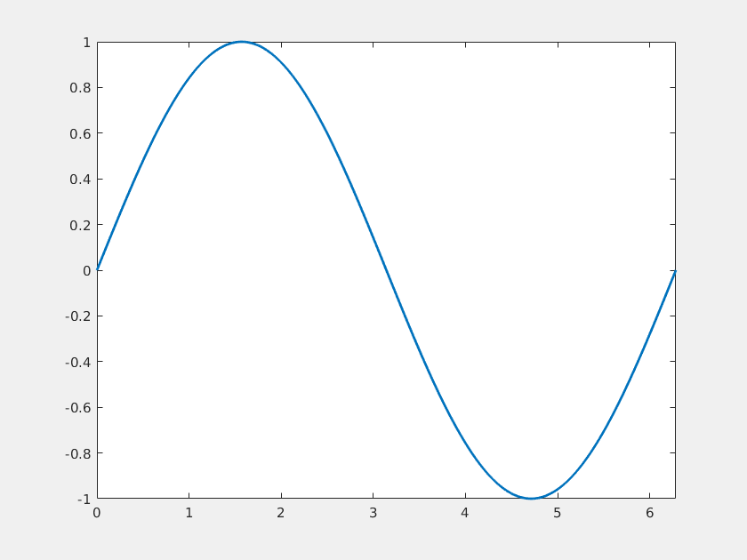
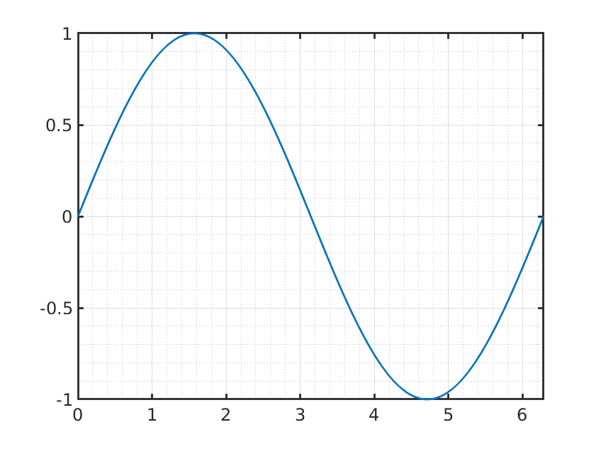
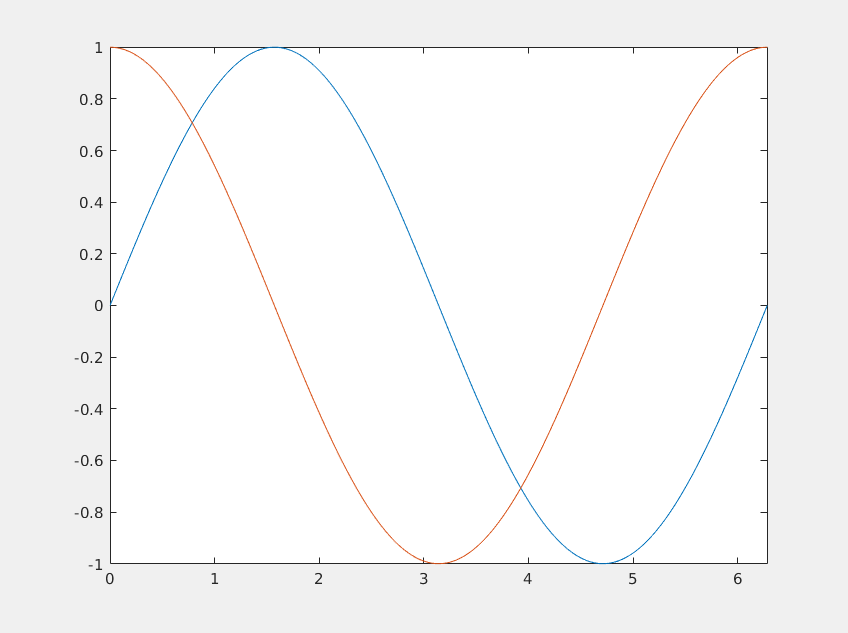
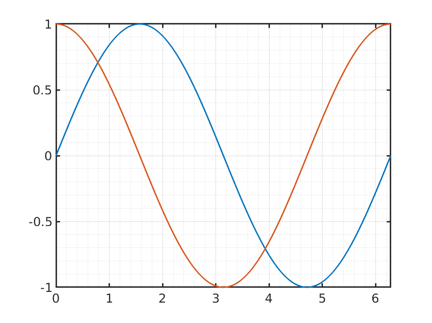

# MATLAB Layout Manager

A static Helper class for managing (saving and restoring) figure, axes and plot layouts.

One major shortcoming of MATLAB is that the default MATLAB figure design is very basic and just plain ugly. Although professional and publication ready figures can be created with MATLAB the formatting requires lots of repetitive adjustments and code calls, that typically have to be repeated over and over again for every figure. With this small MATLAB Layout Manager you can easily save the layout of any figure and restore it to any other figure. The layouts are persistently stored between sessions so that you can easily create templates for your preferred figure designs and apply them to other figures with a single line of code.

## Persistent layout storage

Saved layouts are stored in a ```layoutManager.json``` within the ```userpath``` director defined by MATLAB. 

> The default ```userpath``` is platform-specific:
> * Windows: user's "Documents" folder appended with "MATLAB"
> * Mac:     user's "Documents" folder ($home/Documents) appended with "MATLAB"
> * Linux:   user's $home folder appended by "Documents" and "MATLAB"

Whenever another ```layoutManager.json``` is found in the current working directory this will be used instead of the settings from the ```userpath``` folder. Using a ```layoutManager.json``` file from the current working directory can be an easy way to store project specific layouts.

## Installation

Clone the repository or download the files and add the root folder that contains ```LayoutManager.m``` to your MATLAB path (e.g. ```addpath()```).

## Requirements

The class was tested with Matlab 2019a. Because it uses only very basic MATLAB functions it should work with any decently recent MATLAB version, but probably requires at least Matlab 2014b.

## Note on state of development

The Layout Manager is still in an early stage of development and only a bunch of layout parameters are currently saved and restored. Still quite some features are missing (deleting and editing of layouts, copying of legend and colorbar layout parameters, etc.). Feel free to contribute by using bug reports, feature requests or directly by creating merge requests.

## Usage

To use the Layout Manager is done by using the ```LayoutManager``` static helper class that is available as soon as ```LayoutManager.m``` has been added to the search path. 

### Saving layouts
To save a layout use ```LayoutManager.Save(Name, Handle, Params)``` and pass the ```Name``` of the layout and optionally the figure ```Handle``` (if not specified the current figure will be used) and the type of amount of additional layout ```Params``` that should be saved. 

Possible options for the ```Params``` parameter are:
* ```Full```: store additional figure options such as position and window state
* ```Line```: store line spec parameter such as width and style of lines and markers
> Note: the options for Params can be combined as a comma or space separated string

Example:
```matlab
LayoutManager.Save('Demo', fig1, 'Line');
```

### Loading layouts

To apply a stored layout to any figure use ```LayoutManager.ApplyLayout(Name, Handle)``` and pass the ```Name``` of the layout and optionally the figure ```Handle``` (if not specified the current figure will be used). 

Example:
```matlab
LayoutManager.ApplyLayout('Demo', fig1);
```

### Preview layouts

To see a list of all stored layouts you can call ```LayoutManager.List()```. To see how the layouts look like you can call ```LayoutManager.DemoLayout(Name)``` with the desired layout ```Name``` and a new figure with a demo plot will be created that will use the given layout.

Example:
```matlab
LayoutManager.DemoLayout('Demo')
```

### Example

We start by creating a new figure with a simple plot. As expected the figure looks quite ugly and stupid:

```matlab
fig1 = figure(1);
x = linspace(0, 2 * pi, 1000);
y = sin(x);
plot(x,y, 'LineWidth', 2);
xlim([0, 2 * pi]);
```



Next we have to apply quite a bunch of formatting options to make the figure look reasonable good:

```matlab
grid on;
grid minor;
axis1 = fig1.CurrentAxes(1);
axis1.XAxis.LineWidth = 2;
axis1.YAxis.LineWidth = 2;
axis1.FontSize = 18;
fig1.Color = 'white';;
```



Let's now save the layout under the name ```Demo```
```matlab
LayoutManager.Save('Demo', fig1, 'Line');
```

When now creating another figure by default it will use again the dull MATLAB default layout:

```matlab
fig2 = figure(2);
x = linspace(0, 2 * pi, 1000);
y = sin(x);
y2 = cos(x);
plot(x,y);
hold on;
plot(x,y);
hold off;
xlim([0, 2 * pi]);
```



Finally, we use the LayoutManager to restore our previously saved layout:

```matlab
LayoutManager.ApplyLayout('Demo', fig2);
```

